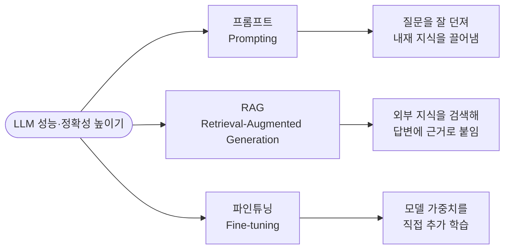
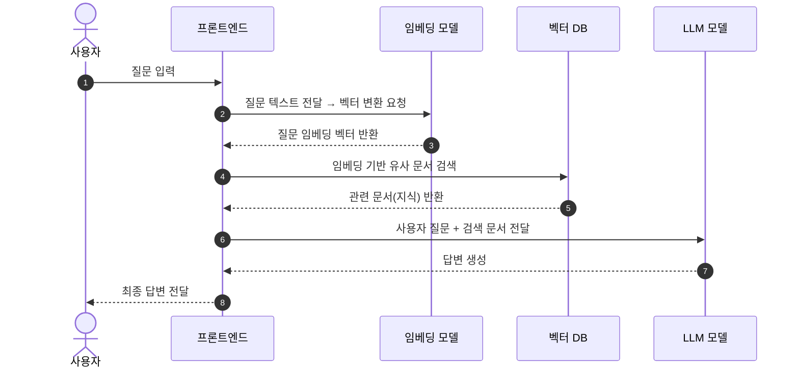
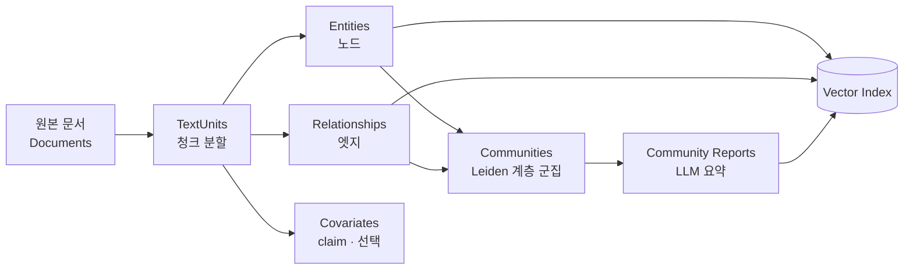
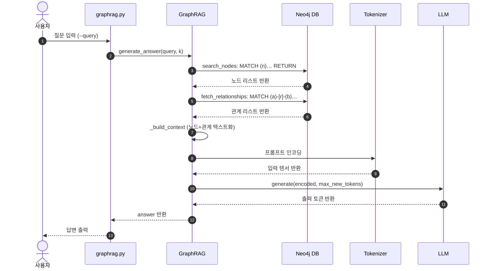

> **한 문장 요약** — RAG는 "질문과 비슷한 문서를 찾아 붙여주는" 기술이고, GraphRAG는 여기에 "정보 사이의 관계를 그래프로 연결해 붙여주는" 기술입니다. 관계와 종합적 이해가 필요한 질문일수록 GraphRAG의 가치가 커집니다.

## 들어가며

대규모 언어 모델(LLM)은 놀라운 답변을 만들어내지만, 학습하지 않은 최신 정보나 우리 회사·연구실 내부 지식은 알지 못합니다. 그래서 우리는 LLM의 성능과 정확성을 높이기 위해 크게 세 가지 기술을 씁니다: **프롬프트(Prompting)**, **RAG(Retrieval-Augmented Generation)**, **파인튜닝(Fine-tuning)**.


*LLM의 성능·정확성을 높이는 세 가지 핵심 기술. 이 글은 그중 RAG, 그리고 RAG를 확장한 GraphRAG를 다룬다.*

이 글은 RAG에서 출발합니다. RAG의 원리를 차근차근 살펴본 뒤, RAG가 태생적으로 잘 못하는 부분 — 바로 *정보들 사이의 '관계'* — 을 이해합니다. 그리고 그 빈틈을 **지식 그래프(Knowledge Graph)** 로 메운 기술, **GraphRAG** 가 어떻게 작동하는지, 실제 인덱싱·검색은 어떤 단계로 이뤄지는지, 최신 연구에서 성능은 정말 더 나은지까지 파고듭니다.

---

## 1. RAG란 무엇인가

**Retrieval-Augmented Generation(RAG)** 은 LLM이 답변을 생성하기 전에, 학습 데이터 바깥의 **신뢰할 수 있는 외부 지식**을 참조하도록 만드는 방법입니다. 크게 두 역할로 나뉩니다.

- **Retriever(검색기)** — 사용자의 질문에 맞는 정보를 외부 문서에서 찾아옵니다.
- **Generator(생성기)** — 검색된 정보를 바탕으로 자연스러운 문장을 만들어냅니다.


*질문 → 스마트 검색 → 관련 문서 획득 → LLM이 문서 기반으로 답변 생성. 외부 지식 저장소(Knowledge Base)가 핵심이다. (출처: AWS, "What is Retrieval-Augmented Generation" 도식 기반)*

### RAG의 두 축: 검색과 생성

**검색(Retrieval)** 단계에서는 사용자의 질문을 임베딩 모델이 벡터로 바꾸고, 벡터 데이터베이스에서 의미가 가까운 문서 조각(snippet)을 찾습니다. **생성(Generation)** 단계에서는 찾아온 조각을 원래 질문과 함께 LLM에 넣어 "X는 …다" 같은 답변을 만들어냅니다.

> **왜 RAG가 중요한가**
> LLM은 답을 모를 때 그럴듯한 **허위 정보(환각, hallucination)** 를 지어내거나, 오래된 일반 정보를 내놓거나, 출처가 불분명한 답을 만들기도 합니다. RAG는 외부의 검증된 데이터를 생성 과정에 끼워넣어 이 한계를 보완하고, 답변의 사실적 정확성을 높입니다.

### RAG는 실제로 어떻게 작동할까

RAG 시스템은 보통 세 부품으로 구성됩니다: **Vector DB**(문서 저장·검색), **Text Embedding Model**(문서 → 벡터 변환), **LLM**(검색 결과 기반 답변 생성).


*Vector RAG의 작동 시퀀스: 질문 → 임베딩 → 벡터 DB 유사도 검색 → 문서 반환 → LLM 답변 생성.*

> **임베딩과 청킹, 한 걸음 더** — RAG의 품질은 사실 "무엇을 검색 가능하게 만드느냐"에서 절반이 결정됩니다. 문서를 얼마나 잘게 자르는지(청크 크기·중첩), 어떤 임베딩 모델을 쓰는지, 검색 후 재순위(re-ranking)를 거치는지가 최종 답변의 정확도를 좌우합니다.

---

## 2. RAG의 발전: Naive → Advanced → Modular

RAG도 한 번에 완성된 것이 아니라 단계적으로 발전해왔습니다.


*외부 지식 요구도(세로)와 모델 적응 요구도(가로) 위에 놓인 RAG·파인튜닝·프롬프트의 지형도. (출처: Gao et al., "Retrieval-Augmented Generation for Large Language Models: A Survey", arXiv:2312.10997)*

### Naive RAG — 가장 기본형

- **인덱싱(Indexing)** — 외부 지식 데이터를 검색 가능하도록 준비합니다.
- **검색(Retrieve)** — 사용자 입력에 맞는 정보를 문서에서 찾습니다.
- **생성(Generation)** — 찾은 정보를 질문과 합쳐 답변을 만듭니다.

> **Naive RAG의 한계** — ① 검색 품질: 외부 데이터가 있다고 항상 질문에 딱 맞는 내용을 찾는 건 아니다. ② 응답 품질: 정보를 더한다고 늘 만족스러운 답이 나오진 않는다. ③ 증강 과정: 검색된 내용이 항상 생성에 도움이 되는 것도 아니다.

### Advanced RAG — 검색 전·후를 다듬다

- **검색 전(Pre-Retrieval)** — 텍스트 표준화, 청크 크기 조정, 그래프 구조 도입으로 인덱스 최적화, 메타데이터 추가 등 다양한 검색 기술을 조합.
- **검색 후(Post-Retrieval)** — *재순위화(Re-ranking)* 로 관련성 높은 정보를 문맥의 핵심 위치로 옮기고, *프롬프트 압축* 으로 노이즈를 줄이고 핵심 문단을 부각.

> **Advanced RAG의 한계** — 처리 능력의 한계, 데이터 최신성 확보의 어려움, 사용자 의도에 대한 제한된 맥락 이해.

### Modular RAG — 부품처럼 조립하다

검색·생성 과정을 **모듈**로 분리해, 필요에 따라 모듈을 **추가·교체**하거나 모듈 간 **흐름을 조정**합니다. 대표적인 모듈에는 검색·메모리·추가 생성·작업 적응·정렬·검증 모듈 등이 있습니다. 이렇게 하면 RRR·DSP·ITER-RETGEN·Self-RAG 같은 다양한 패턴을 자유롭게 만들 수 있습니다.


*왼쪽부터 Naive → Advanced → Modular RAG. (출처: Gao et al., arXiv:2312.10997)*

> **Modular RAG의 한계** — 긴 컨텍스트에서의 관련 정보 검색, 반사실적 정보 처리(견고성), 멀티모달 정보의 검색·생성, 더 다양한 지표로의 평가 등이 여전히 과제로 남습니다.

---

## 3. RAG의 결정적 약점: '관계'를 못 본다

여기까지의 RAG는 모두 **의미적 유사도**에 기반한 검색입니다. 이 방식에는 근본적인 두 가지 약점이 있습니다.

> **기존 RAG의 두 가지 한계**
>
> **① 정보 연결의 어려움** — 여러 문서에 흩어진 정보 조각을 논리적으로 연결해 새로운 통합 인사이트를 도출해야 할 때 취약합니다.
>
> **② 대규모 정보의 종합적 이해 부족** — 대용량 데이터나 큰 문서 전체를 관통하는 의미를 파악하고 요약하는 작업에서 성능이 떨어집니다.

이 두 번째 약점을 학계에서는 **"전역적 센스메이킹(global sensemaking)"** 문제라고 부릅니다. Microsoft 연구진(Edge et al., 2024)은 벡터 RAG 방식이 코퍼스 전체를 아우르는 센스메이킹을 지원하지 못한다고 지적했습니다. 예를 들어 "이 100만 토큰짜리 문서 모음 전체를 관통하는 핵심 주제 5개는?" 같은 질문은, 비슷한 청크 몇 개를 찾아 붙이는 방식으로는 답할 수 없습니다.

쉽게 말해, RAG는 "이 문장과 비슷한 문장"은 잘 찾지만 "A와 B가 어떤 *관계* 로 연결돼 있는가", "전체를 요약하면 무엇인가"는 잘 다루지 못합니다. 이 관계를 명시적으로 다루기 위해 등장한 개념이 **지식 그래프** 입니다.

---

## 4. 지식 그래프(Knowledge Graph) 이해하기

**지식 그래프**는 현실 세계의 개체(노드)와 그들 사이의 관계(엣지)를 연결해 표현하는 데이터 구조입니다. 복잡한 정보를 컴퓨터가 이해하기 쉽게 구조화하고, 데이터 간 의미 있는 연결을 통해 새로운 지식을 추론하며 검색을 고도화하는 기술입니다. 한마디로 **데이터를 기계가 이해할 수 있는 의미적 구조로 재편하는 기술** 입니다.

### '지식'과 '그래프'

먼저 **지식**은 흔히 **DIKW**(Data → Information → Knowledge → Wisdom) 모델로 설명됩니다. 흩어진 데이터가 관계로 연결될수록 정보가 되고, 지식이 되고, 마침내 통찰과 지혜가 됩니다.


*DIKW 모델 — 점(데이터)이 연결되고 구조를 이룰수록 Data → Information → Knowledge → Wisdom으로 발전한다(그림은 Knowledge와 Wisdom 사이에 Insight 단계를 추가한 변형). (출처: Rootstrap, "The DIKW Model", medium.com/data-science)*

한편 **그래프**는 정점(노드)과 간선(엣지)의 집합입니다. 간선에는 방향과 가중치를 줄 수 있습니다. 소셜 네트워크, 분자 구조, 지도 등 실생활의 수많은 대상이 그래프로 표현됩니다.

### 데이터의 연결, 그리고 '의미'의 부재

정보를 연결하려는 시도는 오래되었습니다. 1945년 Vannevar Bush가 "As We May Think"에서 하이퍼텍스트 개념을 처음 소개했고, Ted Nelson·Douglas Engelbart가 이를 이론화했으며, Tim Berners-Lee가 WWW로 실현했습니다. 그러나 이 연결은 '문서'와 '문서' 사이의 연결이었습니다.

> **하이퍼링크의 한계** — 문서 간 하이퍼링크는 단순한 참조 관계일 뿐, 두 문서 사이의 **의미적 관련성(관계의 종류·강도·방향성)** 을 명시적으로 표현하지 못합니다.

이를 풀기 위해 Tim Berners-Lee는 1998년 **시맨틱 웹(Semantic Web)** 을 제안했습니다. **온톨로지**로 스키마를 정의하고, **RDF**로 데이터를 `<주어, 서술어, 목적어>` 형태로 기술하며, 각 데이터는 고유 식별자 **URI**를 갖습니다. 문서 단위가 아니라 *데이터 단위* 로 연결된다는 것이 핵심입니다. 이를 실제 데이터 수준에서 구현한 것이 **링크드 데이터(Linked Data)** 이며, DBpedia·Wikidata·YAGO·Freebase 같은 프로젝트로 이어졌습니다.

- **온톨로지(Ontology)** — 세상에 어떤 개념들이 있고, 그 개념들이 어떻게 연결될 수 있는지 정해 놓은 약속.
- **RDF** — 온톨로지에서 정한 규칙에 맞춰 실제 사실을 한 줄씩 적는 형식. 주어–서술어–목적어 트리플로 표현.
- **URI vs URL** — URL은 실제 '링크'로 작동하지만, URI는 링크가 아닐 수도 있는 순수 식별자.

### Knowledge Graph의 등장

'지식 그래프'라는 용어 자체는 **Google이 2012년 검색 서비스를 지식 그래프로 구성** 하면서 널리 퍼졌습니다("things, not strings"). 지식 그래프는 주어–서술어–목적어 구조로 표현되고, Neo4j 같은 그래프 데이터베이스로 구축할 수 있으며, 노드 간 관계가 '의미'를 담고 있어 **관계를 통한 추론** 이 가능합니다.


*지식 그래프 예시: 'Mona Lisa'는 'Da Vinci'가 그렸고(painted), 'Louvre'에 있으며(is in), Louvre는 'Paris'에 위치한다(is located in)… 개체와 관계가 명시적으로 연결된다. (출처: NeuralSpace, "Graphs & Neural Networks in NLP", medium.com/neuralspace)*

### 지식 그래프는 어떻게 생성할까

구조화되지 않은 문서에서 지식 그래프를 만드는 과정은 대체로 다음 파이프라인을 따릅니다.

| 단계 | 하는 일 |
|------|---------|
| **Named Entity Recognition (NER)** | 문서를 파싱해 고유명사 같은 주요 엔티티를 뽑아냅니다. |
| **Relation Extraction** | 엔티티 사이의 관계를 추출합니다. |
| **Entity Linking** | 추출한 개체를 기존 지식베이스의 적절한 개체로 연결합니다. |
| **Triple Validation** | `<주어, 서술어, 목적어>` 트리플이 의미 있는지 기존 사실을 참고해 평가합니다. |
| **Knowledge Graph Completion** | 검증된 트리플을 모아 전체 지식 그래프를 완성합니다. |

### 지식 그래프가 중요한 이유

- **이질적 정보 정리** — 데이터를 중앙 집중화하지 않고도 있는 자리에서 연결합니다.
- **운영 효율성** — 복잡한 SQL·코딩 없이도 복잡한 질문을 빠르게 쿼리하고 자동화할 수 있습니다.
- **더 스마트한 의사결정** — 단절된 데이터에서 숨어 있던 패턴·의존성·기회를 찾아냅니다.
- **설명 가능한 AI(XAI)** — 딥러닝이 "왜 그런 판단을 했는지" 설명하기 어려운 반면, 그래프는 추론 경로를 추적할 수 있어 XAI에서 매우 유용합니다.

> **네트워크 연결의 힘** — 1967년 밀그램의 *The Small World Problem* 은 6단계만 거치면 모든 미국인을 연결할 수 있음을 보였고, 2016년 Facebook은 사용자 간 평균 거리가 **3.57** 이라고 발표했습니다.

---

## 5. GraphRAG: RAG + 지식 그래프

> **LLMOps + Graph = GraphRAG.** GraphRAG는 기존 RAG에 지식 그래프를 결합해, LLM 답변의 정확성과 이해도를 끌어올리는 기술입니다.

앞서 본 RAG의 두 약점을 지식 그래프의 **명시적 관계** 로 정면 돌파합니다. 벡터 검색이 "비슷한 것"을 찾는다면, 그래프 검색은 "연결된 것"을 따라갑니다.


*RAG는 텍스트·이미지 등 비정형 데이터를 다루고(왼쪽), GraphRAG는 노드·엣지로 이뤄진 그래프 구조 데이터를 다룬다(오른쪽). (출처: Han et al., "Retrieval-Augmented Generation with Graphs", arXiv:2501.00309)*

### 작동 원리 ① — 그래프 구축 및 인덱싱

1. **지식 그래프 구축** — 문서·DB·웹페이지 등 다양한 소스에서 핵심 **엔티티(노드)** 와 그들 간 **관계(엣지)** 를 추출.
2. **그래프 저장 및 인덱싱** — Neo4j·NebulaGraph·Memgraph 같은 그래프 데이터베이스에 저장.
3. **(선택) 커뮤니티 탐지 및 요약** — 그래프가 커지면 Louvain·Leiden 같은 알고리즘으로 '커뮤니티'를 찾고 요약. 책의 목차·장 요약처럼 방대한 그래프를 효율적으로 탐색하게 해줍니다.

### 작동 원리 ② — 검색 및 생성

1. **질문 분석 및 쿼리 변환** — 자연어 질문을 그래프 DB가 이해하는 쿼리 언어(Cypher, SPARQL 등)로 변환.
2. **그래프 탐색(Graph Traversal)** — 시작 노드에서 관계(엣지)를 따라가며 연결된 정보를 탐색. **다중 홉(Multi-hop) 추론** 에 강함.
3. **컨텍스트 구성** — 서브그래프·엔티티·관계·커뮤니티 요약을 LLM이 이해할 컨텍스트로 정리.
4. **답변 생성** — 구조화된 컨텍스트 + 원본 질문 → LLM → 최종 답변.


*GraphRAG 아키텍처: 그래프 DB(Lexical Graph + Domain Graph)에서 Search / Pattern Match / Query로 정보를 얻어 Context를 구성하고, Instruction과 함께 LLM에 전달해 Answer를 생성한다. (출처: graphrag.com / Gradient Flow 도식 기반)*

### GraphRAG의 장점과 단점

**장점**

- **명시적 관계 모델링** — 인과·계층·소유 등 복잡한 관계를 명확히 표현·추론
- **향상된 문맥 이해** — 연결된 노드·관계로 풍부한 맥락 제공
- **다중 홉 추론** — 여러 단계의 관계를 따라 복잡한 질문 처리
- **높은 설명 가능성** — 어떤 경로로 답을 도출했는지 추적 가능
- **정확도↑·환각↓** — 구조화된 사실 기반이라 환각이 줄고 정확도가 오름

**단점**

- **구축·유지의 복잡성** — 엔티티·관계 추출과 최신화에 상당한 노력
- **전문 지식·도구 요구** — 그래프 DB, Cypher/SPARQL, 온톨로지 설계
- **성능·확장성 문제** — 그래프가 커지면 쿼리 속도 저하 가능
- **초기 비용·노력** — 구축·구현·전문가 확보에 투자 필요
- **유연성 제약** — 엄격한 스키마는 예상 밖 변화에 대응하기 어려움

---

## 6. 인덱싱 파이프라인 자세히 (Microsoft GraphRAG)

"그래프를 구축한다"는 말은 추상적입니다. 실제로 Microsoft GraphRAG는 각 TextUnit에서 LLM으로 핵심 엔티티·관계·주장(claim)을 식별하고, Leiden 클러스터링으로 관련 요소를 묶은 뒤, 각 그룹과 구성요소를 아래에서 위로 요약합니다. 공식 문서 기준으로 인덱싱은 다음 산출물을 순서대로 만들어냅니다.


*Microsoft GraphRAG 인덱싱 데이터플로우 (내용 출처: microsoft.github.io/graphrag).*

- **TextUnit** — 분석 단위가 되는 텍스트 청크. 크기·중첩·경계 규칙을 설정합니다.
- **Entity** — TextUnit에서 추출한 개체(사람·장소·사건 등). 그래프의 노드가 됩니다.
- **Relationship** — 두 엔티티 사이의 관계. 그래프의 엣지가 되며, 등장 빈도로 가중치가 매겨집니다.
- **Covariate** — 엔티티에 대한 시간 제약이 있는 사실 주장(claim). 기본값은 꺼져 있습니다.
- **Community** — 엔티티·관계 그래프에 **계층적 Leiden 알고리즘**을 재귀적으로 적용해 만든 군집.
- **Community Report** — 각 커뮤니티의 내용을 LLM이 요약한 보고서. 전역 질문에 답할 때 쓰입니다.

이렇게 만들어진 텍스트 청크·엔티티·관계·커뮤니티 보고서는 모두 벡터화되어 저장됩니다. 즉 GraphRAG는 그래프와 벡터 인덱스를 *둘 다* 갖게 됩니다.

> **Louvain vs Leiden** — 둘 다 커뮤니티 탐지 알고리즘이지만, Leiden은 Louvain이 가끔 만들어내는 "연결이 끊긴 커뮤니티" 문제를 해결해 **잘 연결된 커뮤니티를 보장** 합니다(Traag et al., 2019).

---

## 7. Local vs Global vs DRIFT 검색

GraphRAG의 진짜 강점은 **질문의 성격에 따라 다른 검색 전략** 을 쓴다는 데 있습니다.

| 전략 | 작동 방식 | 적합한 질문 |
|------|-----------|-------------|
| **Local Search** | 질문과 관련된 **엔티티를 진입점** 으로 찾아, 이웃 노드·관계·원본 텍스트·커뮤니티 정보를 모아 컨텍스트를 구성. | "특정 인물/개체에 대해 자세히" 같은 국소적 질문 |
| **Global Search** | **커뮤니티 요약** 들을 map-reduce로 처리 — 각 커뮤니티가 병렬로 부분 답을 내고, 이를 종합해 전역 답을 만듦. | "전체를 관통하는 주제/패턴은?" 같은 종합 질문 |
| **DRIFT Search** | Global의 넓은 시야와 Local의 깊이를 **결합**. | 넓이와 깊이를 모두 요구하는 혼합 복잡도 질문 |

> **수치로 보는 개선** — DRIFT는 넓이와 깊이를 함께 요구하는 질문에서 표준 Local 검색보다 우수하며(한 리뷰 분석은 약 15~25% 개선으로 소개), 혼합 복잡도 질문의 권장 검색 방식으로 자리 잡았습니다. 또한 Microsoft Research가 공개한 동적 커뮤니티 선택 방식의 Global 검색은, 레벨 1 정적 검색 대비 각각 58%, 60%의 승률을 기록하며 토큰 비용까지 낮췄습니다(2024-11).

더 최근에는 **LazyGraphRAG** 가 등장했습니다. 인덱싱 시점에 커뮤니티 요약을 미리 만들지 않고 질의 시점에 필요한 것만 처리해 비용을 크게 줄이는 방식입니다.

---

## 8. Cypher로 보는 그래프 탐색

그래프 DB에 질문하는 언어가 바로 **Cypher**(Neo4j)입니다. SQL이 표(row/column)를 다룬다면, Cypher는 *패턴* 을 다룹니다. 노드는 소괄호 `()`, 관계는 대괄호 `[]`, 방향은 화살표 `-->` 로 그림 그리듯 씁니다.

**① 노드 하나 찾기**

```cypher
// 이름이 'Mona Lisa'인 작품 노드 찾기
MATCH (m:Artwork {name: 'Mona Lisa'})
RETURN m.name, m.year
```

**② 관계 따라가기 (1-hop)**

```cypher
// 다빈치가 그린 모든 작품
MATCH (p:Person {name: 'Da Vinci'})-[:PAINTED]->(art:Artwork)
RETURN art.name
```

**③ 다중 홉(Multi-hop) 추론 — GraphRAG의 핵심**

```cypher
// "다빈치가 그린 작품은 어느 도시에 있나?" (작품→미술관→도시, 2-hop)
MATCH (p:Person {name: 'Da Vinci'})-[:PAINTED]->(art:Artwork)
      -[:IS_IN]->(museum:Museum)-[:LOCATED_IN]->(city:City)
RETURN art.name, city.name
```

**④ 가변 길이 경로 (1~4 hop 이내 이웃)**

```cypher
// Tom Hanks에게서 1~4단계 안에 연결된 사람들
MATCH (p:Person {name:'Tom Hanks'})-[:KNOWS]-{1,4}(c:Person)
RETURN DISTINCT c.name
```

세 번째 예시가 핵심입니다. 벡터 RAG라면 "다빈치", "미술관", "도시"가 각각 다른 문서에 있을 때 이들을 연결하지 못합니다. 하지만 Cypher는 `PAINTED → IS_IN → LOCATED_IN` 이라는 **관계 경로** 를 한 번에 따라가며 답을 조립합니다. 이것이 GraphRAG가 자랑하는 *다중 홉 추론* 의 실체입니다.

> **참고** — RDF 계열을 쓴다면 Cypher 대신 **SPARQL** 을 씁니다. 많은 그래프 DB(Neo4j, Memgraph, NebulaGraph 등)가 Cypher/openCypher를 지원하며, 이를 확장한 표준이 최근의 **GQL** 입니다.

---

## 9. 벤치마크: GraphRAG는 정말 더 좋은가?

여기서 균형을 잡아야 합니다. GraphRAG는 만능이 아닙니다. "관계가 핵심인 질문"에서는 강하지만, 그렇지 않은 질문에서는 오히려 손해일 수 있습니다.

| 지표 | 값 |
|------|-----|
| 복잡한 다중 개체 질문에서 그래프 검색의 **포괄성(comprehensiveness)** | **86%** (벡터 RAG는 약 57%)\* |
| HotpotQA 다중 홉 질문에서 그래프 검색의 추론 깊이 향상 | **+4.5%** |
| 그래프 검색이 유발하는 평균 지연시간 증가 | **2.3×** |

\* 수치는 데이터셋·평가 방식에 따라 달라집니다. 위 포괄성 비교는 Edge et al.(2024) 계열 평가에서 인용된 값으로, "정확도"가 아니라 LLM 심사 기반 *포괄성* 지표라는 점에 유의하세요.

### GraphRAG가 이기는 곳

100만 토큰 규모 데이터셋에 대한 전역 센스메이킹 질문에서, GraphRAG는 기존 RAG 대비 답변의 **포괄성과 다양성** 모두에서 상당한 개선을 보였습니다(Edge et al., 2024). 특히 루트 레벨 커뮤니티 요약을 쓰면 벡터 RAG보다 훨씬 적은 토큰으로 더 완전한 답을 냈다는 점(토큰 효율)이 자주 인용됩니다.

변종별 강점도 보고됩니다(개별 실무·리뷰 분석 인용, 조건에 따라 상이): HippoRAG의 신경생물학 기반 검색은 다중 홉 추론을 더 저렴하게(문헌에 따라 10~30배), PathRAG의 흐름 기반 가지치기는 컨텍스트를 약 44% 줄이면서 정확도 유지, OG-RAG의 온톨로지 그라운딩은 환각을 약 40% 줄인다고 소개됩니다.

### GraphRAG가 지는 곳 (중요)

> ⚠️ 최근 연구들은 GraphRAG가 많은 실제 과제, 특히 **단일 홉(single-hop) 질문** 에서 전통적 RAG보다 성능이 낮은 경우가 잦다고 보고합니다. Han et al.(2025)에 따르면 Natural Questions에서 GraphRAG는 바닐라 RAG보다 정확도가 13.4% 낮았고, 실시간 지식이 필요한 시간 민감 질문에서는 16.6%까지 정확도가 떨어졌습니다. 반면 HotpotQA 다중 홉 질문에서 그래프 검색이 추론 깊이를 높인 폭은 4.5%에 그친 반면, 평균 2.3배의 지연시간을 추가했습니다(Zhou et al., 2025).

왜 이런 상반된 결과가 나올까요? **질문의 분포** 때문입니다. 단순 사실 조회("이 API의 기본 타임아웃 값은?")는 벡터 RAG로 충분하고 더 빠릅니다. 반면 종합·관계·다중 홉이 필요한 질문("A 부서 제품을 쓰는 B 지역 고객 중 C 서비스 이용자는?")에서 GraphRAG의 진가가 나옵니다.

### WildGraphBench 실측 예시

실제 코퍼스 기반 벤치마크(WildGraphBench, 2026)의 **메인 결과(Table 2)** 를 보면, 방법마다 강약이 뚜렷합니다 (QA 정확도, %). 답변 생성은 GPT-4o-mini, 채점은 GPT-5-mini로 수행됐습니다.

| 방법 | 평균 정확도 | 단일 사실 | 다중 사실 |
|------|:-----------:|:---------:|:---------:|
| NaiveRAG | 59.79 | **66.87** | 35.08 |
| HippoRAG2 | **64.33** | 71.51 | 39.27 |
| MS GraphRAG (local) | 38.23 | 39.43 | 34.03 |
| MS GraphRAG (global) | 54.54 | 56.52 | **47.64** |

주목할 점: **단일 사실** 질문은 NaiveRAG(66.87)가 대부분의 그래프 방식보다 앞서, 답이 한 청크에 담기는 단순 조회에선 그래프 구조가 자동으로 이득이 되지 않음을 보여줍니다. 반면 **다중 사실** 질문에서는 MS GraphRAG(global)가 47.64로 최고 정확도를 기록하며 NaiveRAG(35.08)를 크게 앞섭니다. *여러 문서의 근거를 종합해야 할수록 그래프가 유리하다.*

> **실무 결론** — 2024–2026년 연구 합의는 명확합니다: **GraphRAG의 가치는 질문 복잡도에 비례** 합니다. "무조건 GraphRAG"가 아니라 "우리 질문이 관계형인가?"를 먼저 물어야 합니다.

---

## 10. GraphRAG 변종 지도

"GraphRAG"는 단일 기술이 아니라 하나의 *패러다임* 입니다. 2024년 이후 목적에 따라 여러 갈래로 분화했습니다.

| 변종 | 핵심 아이디어 | 강점 / 특징 |
|------|---------------|-------------|
| **Microsoft GraphRAG** (Edge et al., 2024) | LLM으로 그래프 유도 + 계층적 커뮤니티 요약 | 전역 센스메이킹·교차 문서 종합에 강함. Local/Global/DRIFT 지원 |
| **LightRAG** (Guo et al., 2024) | 단순화된 KG + 이중 레벨(엔티티+주제) 검색 | 커버리지와 효율의 균형, 빠르고 가벼움 |
| **HippoRAG / HippoRAG2** | 인간 장기기억 착안 + Personalized PageRank | 학습 불필요, 다중 홉을 단일 검색으로, 저렴 |
| **LazyGraphRAG** | 인덱스 시점 요약을 미루고 질의 시점에 처리 | 비용 대폭 절감, 복잡한 전역 질문에서 우수 |
| **PathRAG** | 흐름 기반 경로 가지치기(pruning) | 컨텍스트 약 44% 절감하며 정확도 유지 |
| **OG-RAG** | 온톨로지·스키마 제약 하에 추출 | 스키마 그라운딩으로 환각 약 40% 감소 |

이 외에도 FastGraphRAG(속도), GFM-RAG(그래프 신경망), LinearRAG, G-retriever 등이 활발히 연구되고 있습니다.

---

## 11. Vector vs Graph vs Hybrid: 선택 가이드

| 특징 | Vector RAG | Graph RAG |
|------|------------|-----------|
| 검색 메커니즘 | 의미적 유사성 기반 | 관계 기반 탐색 |
| 데이터 표현 | 고차원 벡터 (비정형) | 노드와 엣지 (관계 명시) |
| 복잡한 관계 처리 | 제한적 | 우수 (다중 홉 추론) |
| 지연시간 | 대체로 빠름 (ANN) | 평균 2.3배↑ |
| 적합 사례 | 광범위 의미 검색, 단순 Q&A, 빠른 프로토타이핑 | 복잡한 관계 분석, 도메인 특화, XAI, 다중 홉 |

**Vector RAG가 더 적합할 때**: 주제·개념 중심의 넓은 의미 검색 / 대규모 비정형 텍스트 / 빠른 프로토타이핑 / 응답 속도·확장성 중시 / 단순 Q&A·요약, 시간 민감 질문.

**Graph RAG가 더 적합할 때**: 데이터 간 복잡한 관계가 핵심 / 높은 정확성·설명 가능성(금융·의료·법률) / 다단계(Multi-hop) 추론 / 도메인 특화 지식 활용 / 전역 요약·센스메이킹.

### 하이브리드 RAG: 둘의 장점을 합치다

실무에서는 굳이 하나만 고를 필요가 없습니다. **하이브리드 RAG** 는 Vector Search의 약한 관계 파악을 Graph Search로 보완하고, Graph Search의 초기 탐색 속도·범위를 Vector Search로 메웁니다.


*Knowledge Graph-Enhanced QA 파이프라인: 벡터 검색으로 관련 텍스트를 찾고, 대응 노드·관계를 그래프에서 가져와(필요 시 Cypher) 컨텍스트를 종합한 뒤 LLM이 답변한다. (출처: Gradient Flow, "GraphRAG: Design Patterns, Challenges", gradientflow.substack.com)*

- **순차적(Sequential)** — 벡터 검색으로 후보를 빠르게 찾고, 그 후보의 엔티티를 그래프에서 탐색해 컨텍스트를 정제·확장.
- **병렬적(Parallel)** — 벡터·그래프 검색을 동시에 수행하고 결과를 융합(Fusion)·재순위(Ranking).
- **통합(Integrated)** — 벡터 인덱스를 지원하는 그래프 DB(예: Neo4j)에서 벡터 유사도 검색과 관계 탐색을 단일 DB에서 함께 실행.

---

## 12. 구현 흐름 들여다보기

실제 GraphRAG 구현에서 질문이 답으로 바뀌는 흐름은 다음과 같습니다. (연구자·논문·주제·기법을 `AUTHORED`, `RESEARCHES`, `MEMBER_OF`, `USES_METHOD` 같은 관계로 연결한 지식 그래프 위에서 동작합니다.)


*질문 → 그래프 검색(노드·관계) → 컨텍스트 구성 → LLM 생성 → 답변 출력.*

**단계별 요약**

1. **질문 입력** — 사용자가 CLI 또는 `--query` 옵션으로 질문을 입력.
2. **그래프 검색** — `search_nodes` 로 지정 property에 질문 키워드가 포함된 상위 k개 노드를 찾고, `fetch_relationships` 로 그 노드들의 1-hop 관계를 속성과 함께 가져옴.
3. **컨텍스트 구성** — `_build_context` 로 노드·관계를 텍스트로 변환해 LLM 입력 문자열로 조합.
4. **LLM 입력 & 답변 생성** — `generate_answer` 로 그래프 컨텍스트 + 질문 → 프롬프트 → 토큰 인코딩 → 모델 생성 → 디코딩 → 자연어 답변.
5. **결과 출력** — 완성된 답변을 사용자에게 전달.

**파이프라인 의사코드**

```python
class GraphRAG:
    def generate_answer(self, query, k=5):
        # 1) 그래프 검색: 키워드로 상위 k개 노드
        nodes = self.search_nodes(query, k)          # MATCH (n) ... RETURN ...
        # 2) 검색된 노드의 1-hop 관계 수집
        rels  = self.fetch_relationships(node_ids)   # MATCH (a)-[r]-(b) ...
        # 3) 노드+관계를 LLM용 컨텍스트 문자열로
        context = self._build_context(nodes, rels)
        # 4) 프롬프트 구성 → 토큰 인코딩 → 생성 → 디코딩
        prompt  = f"[그래프 정보]\n{context}\n\n[질문]\n{query}"
        answer  = self.llm.generate(prompt)
        return answer
```

> **실전 팁** — 소비자용 GPU에서 GraphRAG를 돌린 벤치마크(2026)에 따르면, 약 7B 파라미터 미만 모델은 유효한 구조화 출력을 안정적으로 만들지 못해 파이프라인을 완주하지 못하는 실용적 용량 임계값이 있습니다. 엔티티·관계 추출에는 충분히 큰 모델(7B 이상)을 쓰는 것이 안전합니다.

---

## 13. 마무리

RAG는 LLM에게 "외부 지식을 찾아 붙여주는" 강력한 도구지만, 정보들 사이의 **관계** 와 **전역적 이해** 에는 한계가 있었습니다. **지식 그래프** 는 개체와 관계를 명시적으로 연결해 이 빈틈을 메우고, 둘을 결합한 **GraphRAG** 는 다중 홉 추론·높은 설명 가능성·환각 감소·전역 센스메이킹이라는 이점을 제공합니다.

그러나 벤치마크가 보여주듯 GraphRAG는 만능이 아닙니다. 그래프 구축·유지의 복잡성과 지연시간이라는 비용이 따르고, 단순·시간 민감 질문에서는 오히려 벡터 RAG가 낫습니다. 결국 정답은 **"우리 질문이 관계형인가, 전역적인가?"** 를 먼저 묻고, Vector·Graph·Hybrid 중에서 — 또는 LightRAG·HippoRAG·DRIFT·LazyGraphRAG 같은 변종 중에서 — 질문 분포에 맞는 것을 고르는 안목입니다.

> **핵심 정리**
> ① RAG = 유사한 문서를 찾아 붙이기 · ② 지식 그래프 = 개체와 관계를 명시적으로 연결 · ③ GraphRAG = RAG + KG로 '관계'와 '전역 요약'까지 · ④ 인덱싱은 TextUnit → 엔티티·관계 → Leiden 커뮤니티 → 요약 · ⑤ 검색은 Local·Global·DRIFT로 질문에 맞게 · ⑥ 벤치마크상 관계·다중 홉·전역 질문에서 강하고, 단순·시간 민감 질문에선 약함 · ⑦ 실무에선 하이브리드가 안전한 기본값.

---

## 참고 자료

- Edge et al. (2024), *From Local to Global: A Graph RAG Approach to Query-Focused Summarization* — [arXiv:2404.16130](https://arxiv.org/abs/2404.16130)
- Microsoft GraphRAG 공식 문서 (Dataflow / Local·Global·DRIFT) — [microsoft.github.io/graphrag](https://microsoft.github.io/graphrag/)
- Han et al. (2024), *Retrieval-Augmented Generation with Graphs (GraphRAG)* 서베이 — [arXiv:2501.00309](https://arxiv.org/abs/2501.00309)
- Han et al. (2025), *Reasoning with Graphs (RwG)* — 단일 홉 성능 저하 보고, [arXiv:2501.07845](https://arxiv.org/abs/2501.07845)
- Gao et al. (2023), *RAG for Large Language Models: A Survey* — [arXiv:2312.10997](https://arxiv.org/abs/2312.10997)
- Guo et al. (2024), *LightRAG* (arXiv:2410.05779) · Gutiérrez et al. (2024/2025), *HippoRAG / HippoRAG2*
- *When to use Graphs in RAG* (2025) — 비판적 벤치마크 분석, [arXiv:2506.05690](https://arxiv.org/abs/2506.05690)
- *WildGraphBench* (2026) — 실제 코퍼스 벤치마크, [arXiv:2602.02053](https://arxiv.org/abs/2602.02053)
- Neo4j Cypher Manual — [neo4j.com/docs/cypher-manual](https://neo4j.com/docs/cypher-manual/current/)
- AWS — What is Retrieval-Augmented Generation · Google — Introducing the Knowledge Graph: things, not strings
