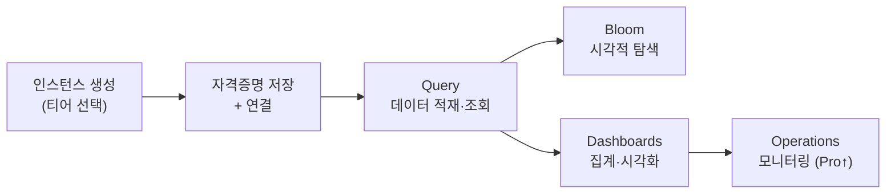

> Sandbox로 그래프 DB를 맛봤다면, 다음은 어디서 이어가야 할까요? 며칠 만에 사라지는 실습 환경 말고, **계속 쓸 수 있는 나만의 그래프 DB** 가 필요해집니다. Neo4j의 완전 관리형 클라우드 서비스 **AuraDB** 를 무료 티어로 시작해, 인스턴스 생성부터 데이터 적재·탐색·시각화까지 한 번에 정리했습니다.

## 왜 AuraDB인가

[Sandbox](https://neo4j.com/sandbox/)는 입문용으로는 훌륭하지만, 초기 며칠만 열려 있는 **휘발성 환경** 입니다. 잠깐 실험하기엔 좋아도, 만든 데이터를 계속 붙잡고 다루기엔 아쉽죠.

**AuraDB** 는 Neo4j가 직접 운영하는 **완전 관리형(fully managed) 클라우드 그래프 DB** 입니다. 서버 설치도, 버전 업그레이드도, 백업 설정도 Neo4j가 알아서 해주기 때문에 우리는 브라우저만 열면 그래프 DB를 바로 다룰 수 있습니다. 무료 티어까지 제공하므로, 운영에 들어가기 전 학습·프로토타이핑 단계에도 잘 맞습니다.

- AuraDB 바로가기: [https://neo4j.com/product/auradb/](https://neo4j.com/product/auradb/)


*Neo4j 공식 홈페이지. "Start building"으로 들어가 로그인하면 AuraDB 콘솔로 이동한다.*

---

## 어떤 티어를 골라야 할까

로그인하면 AuraDB 콘솔이 열립니다. 왼쪽 메뉴의 **Instances** 로 들어가면 인스턴스를 만들 수 있는데, 아직 하나도 없으니 "Create your first instance" 화면이 반겨줍니다.


*Instances 화면. 아직 생성된 인스턴스가 없어 "Create your first instance"가 보인다.*

**Create instance** 를 누르면 가장 먼저 티어를 고르게 됩니다. AuraDB의 티어는 크게 셋으로 나뉘고, 선택 기준은 결국 **"실서비스에 얼마나 가까운가"** 입니다.


*Create instance 화면. Professional·Business Critical·Free 세 티어를 비교하고, 하단에서 인스턴스 이름을 지정한다. 여기서는 Free를 선택했다.*

| 티어 | 요금 | 특징 | 추천 대상 |
|------|------|------|-----------|
| **Professional** | 시간당 약 $0.09 부터 | 매일 자동 백업(7일 보관), 데이터 규모에 따라 메모리 확장, 그래프 알고리즘·벡터 최적화, 로그·메트릭 모니터링 | 소규모 실서비스 |
| **Business Critical** | 시간당 약 $0.20 부터 (최소 2GB) | 전담 기술팀 24/7 지원, 백업 30일 보관·복구, Custom RBAC·IP 필터링·SSO, 99.95% 가동 SLA | 엔터프라이즈급 실서비스 |
| **Free** | $0 | 노드 20만·관계 40만 제한, 제한된 메모리·CPU, 30일 미사용 시 자동 삭제 | 학습·프로토타이핑 |

정리하면 이렇게 고르면 됩니다. 실제 서비스에 그래프 DB를 얹고 싶다면 **Professional**, 그걸로도 부족한 엔터프라이즈 규모라면 전담 지원과 SLA가 붙는 **Business Critical**, 아직 공부하고 실험하는 단계라면 **Free** 입니다. Free는 노드 20만·관계 40만이라는 제한이 있지만, 입문 단계에서 이 한도를 채우기는 쉽지 않으니 충분합니다.

이 글에서는 **Free** 티어로 진행합니다.

---

## 인스턴스 만들고 연결하기

### ① 자격증명(Credentials) 받기

Free를 고르고 인스턴스 이름을 정한 뒤 **Create instance** 를 누르면, 접속에 필요한 **자격증명 창** 이 곧바로 뜹니다. 여기서 딱 한 번만 볼 수 있는 값이 있으니 주의가 필요합니다.


*Credentials 창. Username과 Password가 표시된다. 이 시점 이후에는 비밀번호를 다시 볼 수 없으니 반드시 저장해야 한다. (Password는 보안상 흐림 처리)*

> ⚠️ **보안 주의** — 창에 "Note that the password will not be available after this point."라고 쓰여 있듯, **비밀번호는 이 화면을 벗어나면 다시 볼 수 없습니다.** 반드시 저장해두세요. 그리고 자격증명은 절대 공개 저장소나 블로그에 그대로 올리면 안 됩니다. 위 스크린샷도 민감 값을 가려서 실었습니다.

**Download and continue** 를 누르면 접속 정보가 담긴 txt 파일이 내려받아집니다. 인스턴스가 완전히 준비되기까지는 보통 3~5분 걸립니다.


*인스턴스 생성 화면(3~5분 소요)과 다운로드된 접속 정보 txt. NEO4J_URI·USERNAME·PASSWORD·DATABASE·INSTANCEID가 담겨 있다. (URI·비밀번호는 보안상 흐림 처리)*

이 txt 한 장에 앞으로 쓸 연결 정보가 모두 들어 있습니다.

- `NEO4J_URI` — 접속 주소 (예: `neo4j+s://<instance-id>.databases.neo4j.io`)
- `NEO4J_USERNAME` / `NEO4J_PASSWORD` — 계정·비밀번호
- `NEO4J_DATABASE` — DB 이름
- `AURA_INSTANCEID` / `AURA_INSTANCENAME` — 인스턴스 식별 정보

애플리케이션에서 드라이버로 붙을 때 그대로 쓰이는 값들이니, 잘 보관해두면 됩니다.

### ② 생성된 인스턴스 살펴보기

생성이 끝나면 인스턴스가 `RUNNING` 상태로 바뀝니다. **Connect** 버튼을 누르면 이 DB를 다루는 네 갈래 입구가 나옵니다.


*생성된 Instance01. Connect 드롭다운에서 Query·Bloom·Dashboards·Developer hub를 열 수 있다.*

- **Query** — 쿼리를 날려 데이터를 저장하거나 조회
- **Bloom** — 복잡한 Cypher 없이 그래프를 시각적으로 탐색
- **Dashboards** — 데이터를 집계해 대시보드로 확인
- **Developer hub** — 언어별 드라이버 연결 코드 확인

곧 이 넷을 차례로 써보겠지만, 그 전에 콘솔이 안내하는 전체 흐름을 한 번 훑어보겠습니다.

---

## 콘솔이 안내하는 큰 그림

좌측 **Get started** 는 AuraDB를 처음 쓰는 사람이 어디로 가야 할지 길을 짚어줍니다.


*Get started 페이지. 데이터 적재 → 쿼리 → 애플리케이션 구축 → 운영으로 이어지는 흐름을 단계별로 안내한다.*

흐름은 단순합니다. **① 데이터를 넣고(Import) → ② 쿼리로 다루고(Query) → ③ 애플리케이션에 연결하고(Build) → ④ 운영으로 확장(Production)** 하는 순서죠. 감을 잡기 좋게 **Try a sample dataset** 으로 준비된 예제도 여럿 제공합니다.


*Sample datasets 화면. Social Network Analysis·Crime investigation·Healthcare analysis·Movies 등 학습용 가이드가 준비되어 있다.*

애플리케이션에서 붙을 때는 **Developer hub** 가 편합니다. 언어를 고르면 드라이버 설치 명령과 연결 예제 코드를 바로 복사할 수 있습니다.


*Developer hub. Python·Java·JavaScript·Go·.NET·GraphQL 등 언어별 드라이버 설치·연결 코드를 제공한다.*

내 데이터를 처음부터 올리고 싶다면 **Import** 를 쓰면 됩니다. CSV나 관계형 DB를 데이터 소스로 연결해, 그래프 모델을 설계하며 적재할 수 있는 공간입니다.


*Import 화면. 관계형 DB나 CSV 파일을 데이터 소스로 연결해 Neo4j로 가져올 수 있다.*

---

## Query로 데이터 다루기

이제 본격적으로 데이터를 넣어보겠습니다. **Query** 는 인스턴스에 붙어 그 위에서 Cypher를 실행하는 공간입니다. 처음 들어가면 아직 연결된 인스턴스가 없습니다.


*연결 전 Query 화면. "No instance connected" 상태에서 Connect to instance로 시작한다.*

**Connect to instance** 를 누르면 연결할 인스턴스를 고르는 창이 뜹니다. 앞서 만든 `RUNNING` 상태의 인스턴스를 선택합니다.


*Connect to Neo4j 창. RUNNING 상태의 Instance01을 골라 Connect한다.*

연결되면 상단에 인스턴스·DB·사용자 정보가 뜨고, 왼쪽 **Database information** 패널에 이 DB의 노드·관계·속성 키가 요약됩니다. 아직 아무것도 넣지 않았으니 전부 0입니다.


*연결 완료. "Connected to Instance01 via neo4j+s://" 알림과 함께 시작 가이드가 보인다. (사용자 이메일은 보안상 흐림 처리)*

### 샘플 데이터 넣기

학생·강의·강사·카테고리로 이루어진 간단한 학습 데이터를 만들어보겠습니다. `UNWIND range(...)` 로 반복해 노드를 여러 개 생성하는 Cypher입니다.

```cypher
// 학생 8명
UNWIND range(1, 8) AS i
CREATE (:Student {id: i, name: 'Student ' + i});

// 강의 5개
UNWIND range(1, 5) AS i
CREATE (:Course {id: i, title: 'Course ' + i});

// 강사 3명
UNWIND range(1, 3) AS i
CREATE (:Instructor {id: i, name: 'Instructor ' + i});

// 카테고리 2개
CREATE (:Category {name: '그래프'})
CREATE (:Category {name: 'AI'})
```


*에디터에 학생·강의·강사·카테고리 생성 Cypher를 작성한 모습.*

실행하면 각 구문이 차례로 성공 처리되고, 왼쪽 패널의 **Nodes** 가 **18개**(Student 8 + Course 5 + Instructor 3 + Category 2)로 늘어납니다. 방금 만든 라벨(Category·Course·Instructor·Student)과 속성 키(title 등)도 바로 잡히는 걸 볼 수 있습니다.


*실행 완료. Nodes(18)와 함께 라벨·속성 키가 새로 잡힌다. (사용자 이메일은 보안상 흐림 처리)*

---

## Bloom으로 그래프 탐색하기

데이터가 들어갔으니 눈으로 확인할 차례입니다. Query에서 Cypher를 짜서 봐도 되지만, **Bloom** 을 쓰면 쿼리 없이도 그래프를 시각적으로 탐색할 수 있습니다. 검색어로 노드를 찾아 관계를 따라 펼쳐보는 방식이라, 구조를 직관적으로 파악하기에 좋습니다.


*Bloom의 Explore your graph 화면. 검색으로 노드를 찾아 그래프를 시각적으로 펼쳐볼 수 있다. (사용자 이메일은 보안상 흐림 처리)*

---

## Dashboards로 집계·시각화하기

**Dashboards** 는 데이터를 집계해 차트로 보여주는 공간입니다. 처음엔 만들어둔 대시보드가 없습니다.


*Welcome to Dashboards! 데이터를 넣은 뒤 Create로 나만의 대시보드를 만들 수 있다. (사용자 이메일은 보안상 흐림 처리)*

**Create** 를 누르면 만드는 방식이 세 가지 나옵니다 — AI로 자동 생성, 직접 만들기, 가져오기. 여기서는 **Create from scratch** 로 직접 만들어보겠습니다.


*Create 드롭다운. Create with AI·Create from scratch·Import 중에서 고른다. (사용자 이메일은 보안상 흐림 처리)*

새 대시보드가 열리면 **Take the tour** 를 따라가며 카드를 추가할 수 있습니다.


*New dashboard. "Add a card to get started"에서 Take the tour 또는 Add a card로 시작한다. (사용자 이메일은 보안상 흐림 처리)*

투어를 따라 카드를 하나 만들면, 앞서 넣은 데이터가 곧바로 차트로 집계됩니다.


*라벨별 노드 수를 보여주는 막대그래프. Student(8)·Course(5)·Instructor(3)·Category(2)가 한눈에 집계된다. (사용자 이메일은 보안상 흐림 처리)*

방금 Cypher로 넣은 숫자가 그대로 시각화되는 걸 보면, 적재 → 탐색 → 집계로 이어지는 한 사이클이 완성된 셈입니다.

---

## Operations — 모니터링은 유료부터

마지막으로 **Operations** 를 짚고 넘어가겠습니다. 여기서 CPU·메모리·저장 공간·트랜잭션 같은 지표(Metrics)와 쿼리·에러 로그(Logs)를 확인하는데, **Free 티어에서는 제공되지 않습니다.**


*Operations의 Resources 화면. Free 티어에서는 메트릭이 가려져 있고 "Upgrade to Professional for metrics" 안내가 보인다.*

간단히만 정리하면 각각 이런 역할입니다.

- **Metrics** — CPU·메모리 사용량, 저장 공간, 트랜잭션 수 등을 보여줘, 지금 쿼리가 자원을 얼마나 쓰는지·사양을 올려야 할 시점인지 판단
- **Logs** — 쿼리 로그, DB 연결 상태, 문법 오류 등 에러를 확인. 사용자가 많은 DB라면 보안·감사 용도로도 활용

학습 단계에서는 없어도 되지만, 실서비스로 넘어가면 반드시 챙겨야 하는 영역입니다.

---

## 정리

여기까지 AuraDB 무료 티어로 **인스턴스 생성 → 자격증명 저장 → 연결 → Cypher로 데이터 적재 → Bloom·Dashboards로 탐색·시각화** 하는 흐름을 처음부터 끝까지 따라가 봤습니다. 설치 하나 없이 브라우저만으로 그래프 DB를 **운영에 가깝게** 다뤄볼 수 있다는 점이 Sandbox와의 가장 큰 차이입니다.


*생성 → 연결 → 쿼리 → 탐색·시각화 → 모니터링으로 이어지는 AuraDB 실습 흐름.*

무료 티어는 **노드 20만·관계 40만 제한** 과 **30일 미사용 시 자동 삭제** 라는 점만 기억하면, 그래프 DB 학습과 프로토타이핑에는 부족함이 없습니다. 그리고 이렇게 만든 AuraDB 인스턴스가, 그대로 **GraphRAG의 지식 그래프 저장소** 가 됩니다. 다음 글에서는 여기에 실제 데이터를 얹고 애플리케이션과 연결하는 과정을 이어가겠습니다.

---

## 참고 자료

- Neo4j 공식 사이트 — [neo4j.com](https://neo4j.com/)
- Neo4j AuraDB — [neo4j.com/product/auradb](https://neo4j.com/product/auradb/)
- Neo4j Cypher Manual — [neo4j.com/docs/cypher-manual](https://neo4j.com/docs/cypher-manual/current/)
- Neo4j Bloom — [neo4j.com/product/bloom](https://neo4j.com/product/bloom/)
