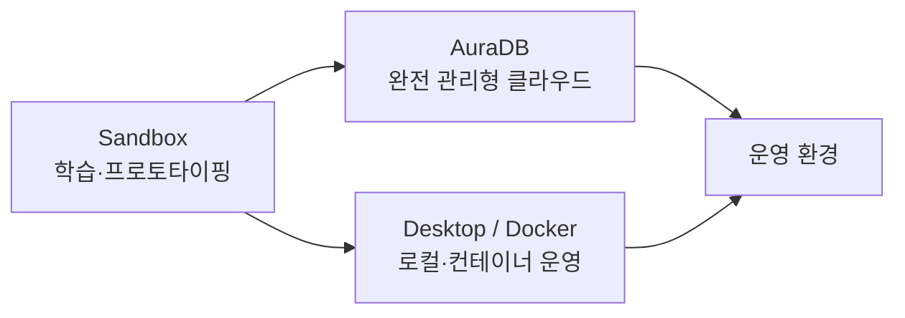

> GraphRAG의 지식 그래프를 어디에 저장할까요? 관계 중심 AI 시스템에서 사실상 표준으로 쓰이는 그래프 DB, **Neo4j** 를 설치 없이 브라우저에서 바로 시작하는 방법을 정리했습니다.

## 왜 Neo4j인가

Neo4j는 노드·관계·속성으로 구성된 **Property Graph 모델** 을 가장 대표적으로 구현한 그래프 DB입니다. 관계 탐색에 최적화된 엔진과 **Cypher** 쿼리 언어를 통해 복잡한 연결 구조를 직관적으로 표현할 수 있어, 관계 중심 AI 시스템에서 사실상 표준처럼 쓰입니다.

- 공식 사이트: [https://neo4j.com/](https://neo4j.com/)

---

## 환경 구축 방법 세 가지

Neo4j를 쓰는 방법은 목적에 따라 크게 세 갈래입니다.

| 방식 | 설명 | 대표 도구 |
|------|------|-----------|
| **클라우드 · 샌드박스** | 설치 없이 브라우저에서 즉시 실행. 학습·빠른 프로토타이핑에 최적 | **AuraDB** (Neo4j 제공 완전 관리형 클라우드 DB), **Sandbox** (학습·데모용 무료 환경, 리소스·기한 제한 있음) |
| **로컬 설치** | 개인 PC·서버에 직접 설치·운영. UI 기반의 직관적 관리 | **Neo4j Desktop** (로컬 개발용 GUI 관리 도구) |
| **컨테이너** | 환경 격리·이식성 확보, 표준화된 배포 | **Docker** (컨테이너 기반 빠른 배포·버전 관리), **Kubernetes** (Enterprise 기반 클러스터링·자동 복구·스케일링) |

이 글에서는 가장 손쉬운 **Neo4j Sandbox** 로 시작해보겠습니다.

---

## Neo4j Sandbox 사용하기

- Sandbox 바로가기: [https://neo4j.com/sandbox/](https://neo4j.com/sandbox/)

### ① Sandbox 실행 & 데이터셋 선택

Sandbox에 접속해 **Launch the Free Sandbox** 로 이동하면, Sandbox에서 바로 사용할 수 있도록 미리 적재해둔 다양한 데이터셋을 고를 수 있습니다. 예를 들어 **Movies** 는 영화 데이터가 적재된 예제이고, **Blank Sandbox** 는 빈 템플릿 느낌으로 되어 있습니다.


*Neo4j Sandbox 시작 페이지. "Launch the Free Sandbox"에서 데이터셋을 선택할 수 있다.*

여기서는 **Movies** 데이터셋을 만들어보겠습니다.

### ② 접속 정보(Credentials) 확인

프로젝트가 생성되면 목록에 `Running` 상태로 표시됩니다. **Create and Download credentials** 를 누르면 접속 정보가 담긴 txt 파일이 다운로드됩니다.


*생성된 Movies Sandbox. 무료 Sandbox는 초기 3일만 열려 있는 휘발성 DB라는 점에 유의하자.*

다운로드된 txt 파일을 열면 앞으로 활용하게 될 Neo4j 연결 정보(접속 URI·계정·비밀번호·DB 이름)가 나옵니다. 같은 정보는 화면 상단 메뉴의 **Connection details** 에서도 확인할 수 있고, **Connect via drivers** 에서는 각 언어에 맞춰 어떻게 연결하는지 코드들도 제공됩니다.


*접속 정보 txt 파일. URI·USERNAME·PASSWORD·DATABASE가 담겨 있다. (일부 값은 보안상 가림)*

> ⚠️ **보안 주의** — 접속 URI·비밀번호는 절대 공개 저장소나 블로그에 그대로 올리지 마세요. Sandbox는 휘발성이라 위험이 작지만, AuraDB·로컬 운영 DB라면 자격증명 노출이 곧 침해로 이어집니다. 위 스크린샷도 민감 값을 가려서 실었습니다.

### ③ 브라우저로 DB 열기

**Open with Browser** 로 이 DB를 열람할 수 있습니다. **Connect with Sandbox Login** 으로 로그인하거나, 앞서 확인한 Database 정보를 입력하면 연결됩니다.

연결되면 왼쪽 **Database information** 패널에서 이 DB가 어떤 노드(Movie, Person)와 관계(ACTED_IN, DIRECTED, FOLLOWS, PRODUCED, REVIEWED, WROTE), 속성 키(born, name, rating, released, roles, summary, tagline, title)를 갖는지 한눈에 볼 수 있습니다.


*Neo4j Browser. 왼쪽 패널에서 노드 라벨·관계 타입·속성 키를 즉시 파악할 수 있다.*

### ④ Cypher로 스키마 확인

영화 데이터셋이 어떻게 생겼는지 바로 확인해봅시다. 먼저 어떤 스키마를 가지고 있는지 쿼리해봅니다.

```cypher
CALL db.schema.visualization()
```


*`db.schema.visualization()` 실행 결과. Movie와 Person 노드가 ACTED_IN·DIRECTED·PRODUCED·REVIEWED·WROTE·FOLLOWS 관계로 연결된 구조를 그래프로 보여준다.*

이 Movie 데이터셋에서 Person 라벨을 가진 노드들이 어떤 관계로 연결되어 있는지 바로 확인할 수 있습니다.

---

## 정리

이처럼 Cypher 쿼리를 통해 Sandbox에서 원하는 샘플 데이터셋을 골라 바로바로 확인할 수 있습니다. 실험해보기가 쉬워 **초보자가 그래프 DB에 입문하기에 아주 유용** 합니다. 기본적으로 무료지만, **초기 3일만 데이터베이스가 열려 있는 휘발성 환경** 이라는 점만 기억하세요.

계속 쓰려면 다음 단계로 넘어가면 됩니다.


*입문은 Sandbox로, 운영은 AuraDB(클라우드) 또는 Desktop/Docker(로컬·컨테이너)로.*

이렇게 만든 Neo4j 인스턴스가 바로 GraphRAG의 지식 그래프 저장소가 됩니다.

---

## 참고 자료

- Neo4j 공식 사이트 — [neo4j.com](https://neo4j.com/)
- Neo4j Sandbox — [neo4j.com/sandbox](https://neo4j.com/sandbox/)
- Neo4j Cypher Manual — [neo4j.com/docs/cypher-manual](https://neo4j.com/docs/cypher-manual/current/)
- Neo4j AuraDB — [neo4j.com/product/auradb](https://neo4j.com/product/auradb/)
