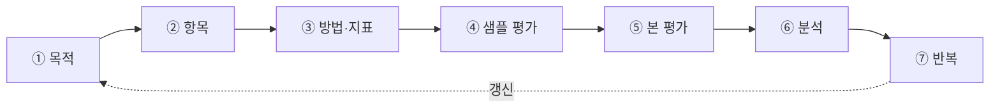

> AI 모델은 하루가 다르게 좋아지는데, 정작 그 실력을 '제대로 재는 일'은 왜 이렇게 어려울까요? 이 글은 AI 평가를 **방법**과 **항목**으로 나눠, 그 헷갈림의 정체를 짚어봅니다.

## 왜 AI 평가는 이토록 어려운가

ChatGPT, Claude 같은 모델이 쏟아지면서 이런 뉴스가 자주 보입니다.

- "벤치마크에서 90점을 넘겼다"
- "Chatbot Arena 순위 1위를 차지했다"

이건 전부 **AI 실력을 채점한 이야기**입니다. 학생을 시험·수행평가·면접으로 나눠 평가하듯, AI도 여러 방법으로 평가합니다.

그런데 "AI를 어떻게 평가할 것인가"는 여전히 어렵습니다. 모델은 빠르게 좋아지는데, 실력을 제대로 재기 어려운 이유는 크게 다섯 가지입니다.

1. **정답 지표가 하나뿐이 아닙니다.** 특정 벤치마크 최고점이 곧 최고의 모델은 아닙니다.
2. **시험을 잘 본다고 실전을 잘하는 건 아닙니다.** 벤치마크와 실제 만족도는 자주 어긋납니다.
3. **환각(Hallucination)** 이 있습니다. 없는 사실을 그럴듯하게 지어내니, 따로 걸러낼 평가가 필요합니다.
4. **정답이 하나가 아닌 질문이 많습니다.** 대화·창작처럼 열린 질문은 채점 기준부터 어렵습니다.
5. **사람이 채점하면 결과가 들쭉날쭉합니다.** 평가자·기분·시점에 따라 달라지고, 비용도 큽니다.

헷갈리는 진짜 이유는, 성격이 다른 **두 질문이 뒤섞여** 있기 때문입니다.

| 질문 | 예시 |
| --- | --- |
| **어떻게?** (방법) | 시험지로? 사람이? AI가 대신? |
| **무엇을?** (항목) | 똑똑한가? 안전한가? 거짓말하지 않나? |

그래서 이 글은 **방법**과 **항목**을 나눠 정리합니다.

> **AI 평가 = "무엇을 볼지(항목)" × "어떻게 채점할지(방법)"**

---

## 1부. 어떻게 평가하나 — 방법 4가지

### ① 벤치마크 평가

표준 공개 데이터셋으로 지식·추론 능력을 숫자로 잽니다.

> **쉽게 말하면** — AI에게 표준 시험지를 주고 점수를 매기는 것

학생의 수능처럼, AI에게도 정해진 시험지가 있습니다.

| 시험지 | 무엇을 보나 |
| --- | --- |
| **MMLU** | 역사·과학·법률 등 57과목 종합 상식 |
| **GSM8K** | 초·중등 수학 |
| **HumanEval** | 코딩 |
| **KMMLU / KoBEST** | 한국어·한국 문화 이해 |

- **장점** — 숫자로 비교하기 쉽습니다.
- **단점** — 시험을 잘 본다고 대화를 잘한다는 보장은 없습니다.

### ② 자동 지표 평가

모범 답안(reference)과 AI 답을 컴퓨터가 자동으로 비교합니다. BLEU, ROUGE, BERTScore 등이 여기 해당합니다.

> **쉽게 말하면** — 모범 답안과 AI 답을 자동으로 대조해 채점

번역·요약처럼 "정답에 가까운 답"이 있을 때 잘 맞습니다.

| 지표 | 한 줄로 |
| --- | --- |
| **BLEU / ROUGE** | 단어(n-gram)가 얼마나 겹치는지 |
| **BERTScore** | 단어가 달라도 뜻이 비슷하면 점수 |
| **Perplexity (PPL)** | 다음 단어를 얼마나 자연스럽게 예측하는지 (**낮을수록 좋음**) |

- **장점** — 빠르고, 사람 손 없이도 채점됩니다.
- **단점** — "정말 좋은 답인지"까지는 잘 못 봅니다.

아래는 세 지표를 조금만 더 깊게 본 내용입니다.

#### BLEU / ROUGE

둘 다 모범 답안과 AI 답 사이 **겹치는 단어 조각(n-gram)** 을 셉니다.

- **BLEU** — 기계 번역용. **정밀도** 중심: "AI가 말한 것 중 정답에 있는 비율"
- **ROUGE** — 요약용. **재현율** 중심: "정답에 있어야 할 것 중 AI가 담은 비율"

한계도 분명합니다. "차가 빠르다"와 "자동차가 신속하다"는 뜻이 비슷해도, 단어가 안 겹치면 점수가 낮습니다.

#### BERTScore

글자 대신 **의미 벡터(임베딩)** 끼리 비슷함을 잽니다. "자동차"와 "차"를 가까운 점으로 보고, 표현이 달라도 의미가 통하면 인정합니다.

다만 "뜻이 비슷한가"까지만 봅니다. 논리나 사실 여부는 잡지 못하고, 한국어처럼 임베딩이 약한 언어에선 신뢰도가 떨어질 수 있습니다.

#### Perplexity (PPL)

정답 없이 **모델이 다음 단어를 얼마나 자신 있게 예측하는지** 봅니다. 값이 낮을수록 "덜 헷갈린다"는 뜻입니다.

주의할 점: PPL이 낮다고 답이 사실·유용하다는 뜻은 아닙니다. 언어의 자연스러움만 볼 때 쓰고, 답변 품질 단독 지표로는 부족합니다.

### ③ 사람 평가

Crowdsourcing, HITL(Human-in-the-loop)처럼 사람이 직접 응답을 보고 선호합니다.

> **쉽게 말하면** — 사람이 답을 읽고, 어느 쪽이 더 나은지 고르는 것

- **블라인드 테스트** — 두 AI에 같은 질문을 던지고, 사람이 고릅니다. **Chatbot Arena**가 대표적입니다.
- **HITL** — 의료·법률처럼 전문 분야에서 전문가가 정확성·안전성을 직접 검토합니다.

- **장점** — 실제 선호를 가장 잘 반영합니다.
- **단점** — 비싸고 느리고, 사람마다 기준이 갈립니다.

### ④ LLM 심사위원 (LLM-as-a-Judge)

G-Eval, MT-Bench처럼 고성능 LLM이 다른 모델의 답을 채점합니다.

> **쉽게 말하면** — 똑똑한 AI에게 다른 AI의 답을 채점시키는 것

사람 채점보다 싸고 빠르며 대량 처리에 좋습니다. 다만 채점 AI에도 편견이 있습니다. 특히 **답이 길면 좋게 보는 버릇**이 대표적입니다.

### 방법 한눈에 보기

| 방법 | 쉽게 말하면 | 강점 | 약점 |
| --- | --- | --- | --- |
| **벤치마크** | 표준 시험지로 점수 매기기 | 비교가 쉬움 | 실전과 다를 수 있음 |
| **자동 지표** | 모범답안과 자동 비교 | 빠르고 저렴 | 답의 질까지는 못 봄 |
| **사람 평가** | 사람이 직접 판단 | 실제 만족도 반영 | 비싸고 느림 |
| **LLM 심사위원** | AI가 대신 채점 | 빠르고 대량 처리 | AI 편견이 섞임 |

### 실전에서 쓰는 방법들

위 네 가지는 주로 **출시 전** 평가입니다. 실전에 더 가까운 응용은 아래와 같습니다.

| 방법 | 무엇을 하나 |
| --- | --- |
| **A/B 테스트** | 실제 서비스에 두 버전을 배포하고, 사용자 반응으로 판단 |
| **레드팀** | 일부러 약점을 파고들어 안전성 점검 |
| **도메인 특화 평가** | 의료·법률·번역처럼 그 분야에 쓸 만한지 별도 검증 |

셋 다 새로운 방법이라기보다, 사람 평가·벤치마크를 실전에 맞게 확장한 형태에 가깝습니다.

---

## 2부. 무엇을 평가하나 — 항목 6가지

방법은 "어떻게 채점하느냐", 항목은 "무엇을 보느냐"입니다. 예전엔 "똑똑한가"만 봤지만, 이제는 "믿고 쓸 만한가"도 중요해졌습니다.

| 항목 | 한 줄 질문 | 예시 |
| --- | --- | --- |
| **성능** | 똑똑한가? | MMLU, GSM8K |
| **사실성** | 거짓말을 지어내지 않나? | TruthfulQA |
| **안전성** | 위험하지 않나? | 유해 답변 테스트 |
| **공정성** | 편향되지 않나? | 편향·독성 테스트 |
| **견고성** | 안정적인가? | 함정·오타 테스트 |
| **효율성** | 실용적인가? | 속도·비용 측정 |

### ① 성능

지식·추론·코딩·언어 능력입니다. MMLU, GSM8K 같은 시험지가 여기에 해당합니다.

### ② 사실성

환각을 잡습니다. 모르는 걸 **아는 척 지어내지 않는지** 봅니다. TruthfulQA가 대표적입니다.

### ③ 안전성

선을 넘는 답(위험·유해한 조언 등)을 하지 않는지 봅니다. 요즘 가장 무거운 항목입니다.

### ④ 공정성

성별·인종·종교 등에서 차별·편향된 답을 하지 않는지 봅니다.

### ⑤ 견고성

질문을 비틀거나 오타·함정을 넣어도 **일관되게** 답하는지 봅니다.

### ⑥ 효율성

속도·비용·메모리처럼 **현실 조건**입니다. 똑똑해도 너무 느리거나 비싸면 못 씁니다.

---

## 3부. 유명한 벤치마크 뜯어보기

| 벤치마크 | 무엇을 보나 |
| --- | --- |
| **ARC** | 초등 자연과학 문제로 추론 능력 |
| **HellaSwag** | 상식 추론 (함정 선택지 포함) |
| **MMLU** | 57과목·15,000여 객관식. 고등~전문가 수준 |
| **GSM8K** | 초등 수학 문장제. 자연어 풀이 과정으로 채점 |
| **HumanEval / MBPP** | 코딩. 단위 테스트 통과 여부 (pass@k) |
| **SWE-bench** | 실제 코드베이스에서 버그 수정·기능 구현 |
| **TruthfulQA** | 헷갈리기 쉬운 질문에 얼마나 진실하게 답하는지 |
| **Winogrande** | 상식 추론 (크라우드소싱 문제) |
| **MT-Bench** | 멀티턴 대화 80문항. GPT-4가 채점 (LLM 심사위원) |
| **Chatbot Arena** | 익명 두 챗봇을 사용자가 투표로 비교 |

벤치마크는 난이도별로 세 묶음으로 나눌 수도 있습니다.

| 묶음 | 보는 것 | 난이도 | 예시 |
| --- | --- | --- | --- |
| **Core-knowledge** | 기초 지식 | 낮음 | MMLU, GLUE |
| **Instruction-following** | 지시 이행 | 중간 | SUPER-NATURALINSTRUCTIONS |
| **Conversational** | 대화 능력 | 높음 | MT-Bench, Rakuda |

---

## 4부. 그런데 — "표준 정답"은 없다

점수가 높다고 무조건 최고는 아닙니다. **LLM에는 단 하나의 표준 지표가 없습니다.**

실제로 2023년 12월, 구글은 제미나이가 MMLU 90.04%로 GPT-4(86.4%)를 앞섰다고 발표했습니다. 그런데 "제미나이에 유리한 시험 방식이 아니냐"는 지적도 나왔습니다. **같은 시험지라도 치르는 방식에 따라 점수가 달라질 수 있다**는 뜻입니다.

그래서 **목적에 맞는 지표**가 필요합니다.

1. **목적이 다르면 지표도 달라집니다.**  
   감성 대화 챗봇을 추론 시험(ARC)으로만 보면 안 됩니다. "정확한가"가 아니라 "매력적인가"를 봐야 합니다.

2. **같은 지표라도 세부 기준이 다릅니다.**  
   정보 챗봇의 만족도는 '원하는 정보를 줬는가', 감성 봇은 '재미·교감이 있었는가'입니다.

3. **난이도도 목적에 맞춰야 합니다.**  
   고등 과학 챗봇을 초등 ARC로 보면 의미가 없고, 초등용에 고등 수학을 욱여넣으면 오히려 만족도가 떨어집니다.

---

## 5부. 실제 평가는 어떤 순서로 하나

설명은 방법부터 했지만, **실전은 방법부터 시작하지 않습니다.** 출발점은 언제나 "이 챗봇은 무엇을 위한 것인가"입니다.

*실무 평가는 '방법'이 아니라 '목적'에서 출발해 순환한다.*

1. **목적 정의** — 정보 / 감성 대화 / 코딩 보조인지, 페르소나·도메인·사용자를 정합니다.
2. **항목 선정** — 6가지 중 우리 서비스에 중요한 것을 고릅니다.
3. **방법·지표 설계** — 어떻게 잴지 정하고, 필요하면 **맞춤형 평가셋**을 만듭니다.
4. **가이드라인 + 샘플 평가** — 전수 전에 소량으로 시범합니다.
5. **본 평가 + 일관성 관리** — 크로스체크로 편차를 잡습니다.
6. **결과 분석** — 점수만이 아니라 문제 패턴·개선 방향까지 뽑습니다.
7. **반복** — 모델·벤치마크가 바뀌면 다시 돕니다.

정리하면:

> **목적 → 항목 → 방법 → 검증 → 실행 → 분석 → 반복**

---

## 6부. 평가는 "일관성"이 생명

사람 평가는 초반·후반, 그날 기분, 평가자에 따라 흔들립니다. 일관성이 무너지면:

- 점수의 **신뢰도**가 흔들리고
- **객관적인 결과**를 얻기 어려우며
- **비용과 시간만 낭비**됩니다.

특히 업데이트 전후 비교에서 기준이 흔들리면, 좋아졌는지조차 모호해집니다.

그래서 **초반 기획·설계**가 중요합니다.

- 주관이 들어가는 항목도 **객관적 세부 지표**로 쪼갭니다.
- 샘플 평가로 지표가 의도대로 도는지 확인합니다.
- 평가자 간 편차는 근거를 모아 **공통 기준**으로 맞춥니다.
- 크로스체크·이슈 공유로 **언제 누가 해도 흔들리지 않는** 결과를 만듭니다.

---

## 7부. 앞으로의 평가는 어디로 가는가

지금까지 방법은 대부분 **단발 텍스트 답 하나**를 채점하는 틀입니다. 하지만 챗봇은 이미 에이전트로 넘어가고 있습니다. 앞으로는 다섯 가지를 함께 고민해야 합니다.

1. **"답 하나"가 아니라 "과정 전체"**  
   중간 도구 호출·불필요한 단계·목표 오해까지 보려면 **궤적(trajectory)** 평가가 필요합니다.

2. **"평가 도구"도 의심한다**  
   LLM 심사위원의 편향(긴 답 선호, 비슷한 문체 선호 등)을 검증하는 절차가 필요합니다.

3. **벤치마크는 계속 낡는다**  
   데이터 오염·만점 포화 때문에, 평가는 **한 번 만들고 끝이 아니라 계속 갱신**해야 합니다.

4. **목적과 지표를 정렬한다**  
   "원하는 사용자 가치 → 그걸 재는 지표"를 거꾸로 내려오는 습관이 가장 본질입니다.

5. **안전성·정렬의 무게가 커진다**  
   똑똑함보다 "위험하지 않은가, 가치에 맞는가"가 더 중요해지고, 레드팀이 실전 핵심이 됩니다.

한 문장으로 요약하면:

> 앞으로는 **"정답 대조 단발 채점"** 에서  
> **"목적에 맞춰, 과정까지, 계속 갱신하며, 평가 도구까지 의심하는 종합 설계"** 로 가야 합니다.

---

## 마치며

AI 평가란 **"어떤 항목 × 어떤 방법"** 의 조합입니다.  
예: 안전성(항목)을 사람 평가(방법)로 검증한다.

완벽한 단 하나의 방법이나 항목은 없습니다. 시험에서 잘 본다고 끝이 아니고, 똑똑하기만 하고 위험하면 못 씁니다. 그래서 현장에서는 여러 방법과 항목을 **서로 엮어** 봅니다.

잘 만든 평가는 점수에서 멈추지 않습니다. 고질적 답변 패턴, 개선 방안, 다음 업데이트 방향까지 남깁니다.  
점수를 내는 것에서 한 걸음 더 — **"그래서 어떻게 더 나아질까"** 까지 가는 것이 평가의 진짜 목적입니다.

다음에 "벤치마크 90점", "Arena 1위" 뉴스를 보면, 이제 **무엇을 어떻게 채점한 결과인지** 한눈에 들어올 겁니다.

---

## 참고 자료

- MMLU — [Measuring Massive Multitask Language Understanding](https://arxiv.org/abs/2009.03300)
- TruthfulQA — [Measuring How Models Mimic Human Falsehoods](https://arxiv.org/abs/2109.07958)
- MT-Bench / LLM-as-a-Judge — [Judging LLM-as-a-Judge](https://arxiv.org/abs/2306.05685)
- Chatbot Arena — [lmarena.ai](https://lmarena.ai/)
- BERTScore — [Evaluating Text Generation with BERT](https://arxiv.org/abs/1904.09675)
